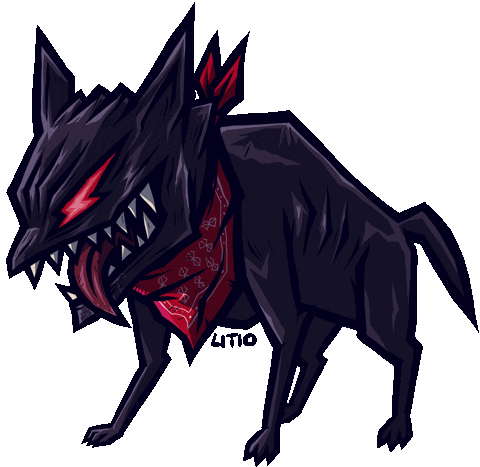

<h2 align="center">
    
     
    
</h2>

<!-- 

    

 -->

    
     

 

    
     
    <a href="https://skillicons.dev">
        
         
        
    </a>

    

	<picture>
	  <source media="(prefers-color-scheme: dark)"  srcset="https://raw.githubusercontent.com/d3ttl4ff/d3ttl4ff/output-3d-contrib/profile-custom-hacker.svg" />
	  
	</picture>

|  | 
&nbsp;
 |
| ------------- | ------------- |

  

 

<!-- 

    
    

 -->

