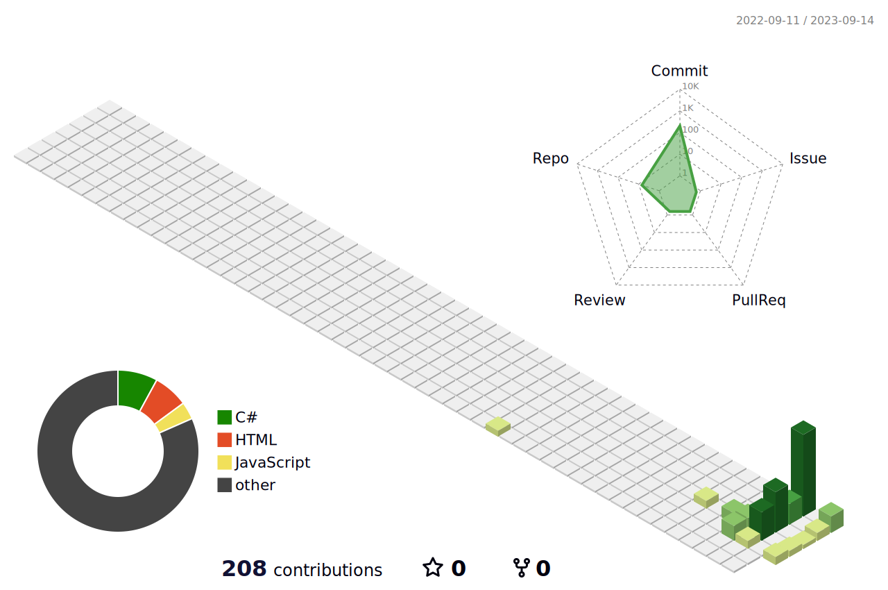

<h2 align="center">
    
</h2>

<!-- 

    

 -->
<!-- 
 -->

<!-- 

 -->

	<picture>
	  <source media="(prefers-color-scheme: dark)"  srcset="https://raw.githubusercontent.com/d3ttl4ff/d3ttl4ff/output-3d-contrib/profile-custom-hacker2.svg" />
	  
	</picture>

    
  

 

|  | 
&nbsp;
 |
| ------------- | ------------- |

