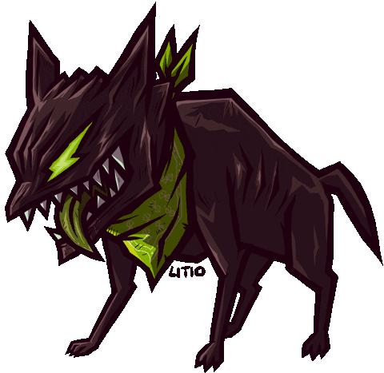

<h2 align="center">

    
    <!--   -->
    
</h2>

    
     

- 🎓 A second-year undergraduate specializing in Cyber Security at 🇬🇧 Staffordshire University 
- 💻 Currently studying Machine Learning 
- 🎨 2d digital artist 
- 🎮 PC/PS gamer  
- 🎸 Hobbyist Guitar player 
- 🌌 Aesthetics lover 
- 🎯 Driven by a strong sense of self discipline to learn and discover new things each day

 

    
     

 

    
     
    <a href="https://skillicons.dev">
        
         
        
    </a>

    

	<picture>
	  <source media="(prefers-color-scheme: dark)"  srcset="https://raw.githubusercontent.com/d3ttl4ff/d3ttl4ff/output-3d-contrib/profile-custom-hacker.svg" />
	  
	</picture>

<!-- 
##rank_icon alternatives
    rank_icon=default
    rank_icon=github
    rank_icon=percentile
 -->
|  | 
&nbsp;
 |
| ------------- | ------------- |

|  |
| -------------------------- |

  

 

<!-- 

    
    

 -->

