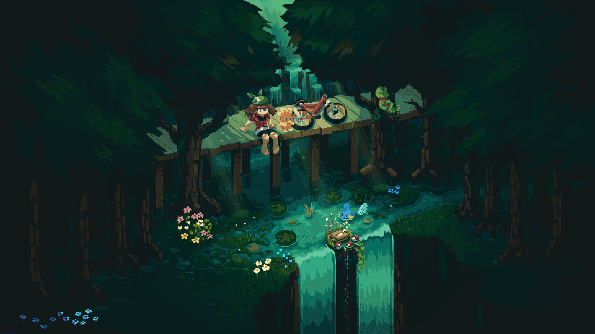

<h2 align="center">
    <!-- 

 -->
    <!--  -->
    
    
    
    
    <!-- 
    
     -->
    <!--  -->
    <!--  -->
</h2>

  

<!-- ---------------------------------------------- -->

 
👩🏻‍💻 Gist of Me

 

💻 Creative Developer 
🎨 3D Generalist 
🪄 Real-Time VFX Artist 

 
<!-- ---------------------------------------------- -->

<!-- ---------------------------------------------- -->

 
🛠️ Tech Stack 

 

![GLSL](https://img.shields.io/badge/glsl-7c3aed?style=for-the-badge&logo=image/png;base64,iVBORw0KGgoAAAANSUhEUgAAACAAAAAgCAYAAABzenr0AAADYElEQVRYhe2XS2zVRRTGf/+2QniUt5AgwoIgaXmKtFQIhJcYLCw0xpjw2JDQlUtJDAkbd27c6K5u3CkEkBoIBEPl/ZJiLYr1GQgYXiI1GqGUj5zku2W89pbeazUsOMnkzp3/zPm+mTlz5psMQBJFWgUwE3gNeALYBnwB3CnGTZZlFEsggFcBrwN1wDigDLgCtAI7gK1AR38TmAG8DCwAqoCn3d7mWc/x/+tuOwxsB1r+DYEngUXAfGCewcM6gV3AfuAccBeoBp4HVgNj3e8EcBI4bUI/9pVA7O1cg78AjHf7N3Z6DNgH/JznbySwwuNq7SPslsk2O066YyUlMBqY7IEvASuTJf0WOAXsMXBfrNarsRh4JlmV446TIPNDlmU3MIEGSe16YL9K2iVpnaShsUIlliGS1kr6RNL1xH9gNXRPRFKTpA5//FPS+5KGSSp3KZVAmcdXSnrPvmWspsCuMIeu4OH6ICDYvQJ8DjS59OloJTYQWOqtqAeeAspzczZm9wrslNQpqUXSVkmX87bjvKQPJNVLquhlxhXu0yjpa0nXEj+X7bvFWDvTFcjVfwLeMdOZjuplwFSX5cB3juTdwBGPXeDgjXwwBZjk9t+cD/Y6UcWs3wJmp6Cp3Qa+B246YpsNHMmnBnjRhJYZsNVjg+x01+8m5L7yKWpPjurtFDCfQKTVwSaAB7Y7Bib6N47YLJ/zHOhfTjaRBc86ds73EBeDjVGQQG92AfjQZZovoi3uH9v2sTNjUVZW7ABbADUm/xtLAQ8rlUBYZYH6/0agX+wxgccEHjkC9/52S/W/dRmjIIEBvo7/i5XJpfkBPREot04LDfimVXB/W1xYm4xxJ9EG/5Bk9yRdkPSppPW9SLLq5K6vLtBnhKQNkvZIuiipK5FkG1MCoyXVSHpD0oHE8VVJhyS9K2lJnvOqpF9V3rdaSW9LOmwfOTslaZOxRgV2T7L8Wd/98/NkedztRy3Lm7yXv/jbBN/zq/1ies4Fi5JQ1AeBLwvJ8p62O/cwWeiHSZ3bfwc+8nNss9viOh7jK3qo245azp8BPgMu5QMU8zSbY5FaZ3U0vkC/3BvxkPV/W29OS3mcRuQGkTXequE+1/H6CT0QoiRKKKSHWikEchaSO+LkVeAPg8Zsi0piWZZxH8kfrrIRMXuZAAAAAElFTkSuQmCC&logoColor=ffffff)

![Bash](https://img.shields.io/badge/Bash-1f425f?style=for-the-badge&logo=image%2Fpng%3Bbase64%2CiVBORw0KGgoAAAANSUhEUgAAABgAAAAYCAYAAADgdz34AAAAGXRFWHRTb2Z0d2FyZQBBZG9iZSBJbWFnZVJlYWR5ccllPAAAAyZpVFh0WE1MOmNvbS5hZG9iZS54bXAAAAAAADw%2FeHBhY2tldCBiZWdpbj0i77u%2FIiBpZD0iVzVNME1wQ2VoaUh6cmVTek5UY3prYzlkIj8%2BIDx4OnhtcG1ldGEgeG1sbnM6eD0iYWRvYmU6bnM6bWV0YS8iIHg6eG1wdGs9IkFkb2JlIFhNUCBDb3JlIDUuNi1jMTExIDc5LjE1ODMyNSwgMjAxNS8wOS8xMC0wMToxMDoyMCAgICAgICAgIj4gPHJkZjpSREYgeG1sbnM6cmRmPSJodHRwOi8vd3d3LnczLm9yZy8xOTk5LzAyLzIyLXJkZi1zeW50YXgtbnMjIj4gPHJkZjpEZXNjcmlwdGlvbiByZGY6YWJvdXQ9IiIgeG1sbnM6eG1wPSJodHRwOi8vbnMuYWRvYmUuY29tL3hhcC8xLjAvIiB4bWxuczp4bXBNTT0iaHR0cDovL25zLmFkb2JlLmNvbS94YXAvMS4wL21tLyIgeG1sbnM6c3RSZWY9Imh0dHA6Ly9ucy5hZG9iZS5jb20veGFwLzEuMC9zVHlwZS9SZXNvdXJjZVJlZiMiIHhtcDpDcmVhdG9yVG9vbD0iQWRvYmUgUGhvdG9zaG9wIENDIDIwMTUgKFdpbmRvd3MpIiB4bXBNTTpJbnN0YW5jZUlEPSJ4bXAuaWlkOkE3MDg2QTAyQUZCMzExRTVBMkQxRDMzMkJDMUQ4RDk3IiB4bXBNTTpEb2N1bWVudElEPSJ4bXAuZGlkOkE3MDg2QTAzQUZCMzExRTVBMkQxRDMzMkJDMUQ4RDk3Ij4gPHhtcE1NOkRlcml2ZWRGcm9tIHN0UmVmOmluc3RhbmNlSUQ9InhtcC5paWQ6QTcwODZBMDBBRkIzMTFFNUEyRDFEMzMyQkMxRDhEOTciIHN0UmVmOmRvY3VtZW50SUQ9InhtcC5kaWQ6QTcwODZBMDFBRkIzMTFFNUEyRDFEMzMyQkMxRDhEOTciLz4gPC9yZGY6RGVzY3JpcHRpb24%2BIDwvcmRmOlJERj4gPC94OnhtcG1ldGE%2BIDw%2FeHBhY2tldCBlbmQ9InIiPz6lm45hAAADkklEQVR42qyVa0yTVxzGn7d9Wy03MS2ii8s%2BeokYNQSVhCzOjXZOFNF4jx%2BMRmPUMEUEqVG36jo2thizLSQSMd4N8ZoQ8RKjJtooaCpK6ZoCtRXKpRempbTv5ey83bhkAUphz8fznvP8znn%2B%2F3NeEEJgNBoRRSmz0ub%2FfuxEacBg%2FDmYtiCjgo5NG2mBXq%2BH5I1ogMRk9Zbd%2BQU2e1ML6VPLOyf5tvBQ8yT1lG10imxsABm7SLs898GTpyYynEzP60hO3trHDKvMigUwdeaceacqzp7nOI4n0SSIIjl36ao4Z356OV07fSQAk6xJ3XGg%2BLCr1d1OYlVHp4eUHPnerU79ZA%2F1kuv1JQMAg%2BE4O2P23EumF3VkvHprsZKMzKwbRUXFEyTvSIEmTVbrysp%2BWr8wfQHGK6WChVa3bKUmdWou%2BjpArdGkzZ41c1zG%2Fu5uGH4swzd561F%2BuhIT4%2BLnSuPsv9%2BJKIpjNr9dXYOyk7%2FBZrcjIT4eCnoKgedJP4BEqhG77E3NKP31FO7cfQA5K0dSYuLgz2TwCWJSOBzG6crzKK%2BohNfni%2Bx6OMUMMNe%2Fgf7ocbw0v0acKg6J8Ql0q%2BT%2FAXR5PNi5dz9c71upuQqCKFAD%2BYhrZLEAmpodaHO3Qy6TI3NhBpbrshGtOWKOSMYwYGQM8nJzoFJNxP2HjyIQho4PewK6hBktoDcUwtIln4PjOWzflQ%2Be5yl0yCCYgYikTclGlxadio%2BBQCSiW1UXoVGrKYwH4RgMrjU1HAB4vR6LzWYfFUCKxfS8Ftk5qxHoCUQAUkRJaSEokkV6Y%2F%2BJUOC4hn6A39NVXVBYeNP8piH6HeA4fPbpdBQV5KOx0QaL1YppX3Jgk0TwH2Vg6S3u%2BdB91%2B%2FpuNYPYFl5uP5V7ZqvsrX7jxqMXR6ff3gCQSTzFI0a1TX3wIs8ul%2Bq4HuWAAiM39vhOuR1O1fQ2gT%2F26Z8Z5vrl2OHi9OXZn995nLV9aFfS6UC9JeJPfuK0NBohWpCHMSAAsFe74WWP%2BvT25wtP9Bpob6uGqqyDnOtaeumjRu%2ByFu36VntK%2FPA5umTJeUtPWZSU9BCgud661odVp3DZtkc7AnYR33RRC708PrVi1larW7XwZIjLnd7R6SgSqWSNjU1B3F72pz5TZbXmX5vV81Yb7Lg7XT%2FUXriu8XLVqw6c6XqWnBKiiYU%2BMt3wWF7u7i91XlSEITwSAZ%2FCzAAHsJVbwXYFFEAAAAASUVORK5CYII%3D&logoColor=FFDE57)

<!-- 

    <a href="https://skillicons.dev">
        
         
        
    </a>

 -->

 
<!-- ---------------------------------------------- -->

 
🧪 My Contributions

 

<!-- ##

	<picture>
	  <source media="(prefers-color-scheme: dark)"  srcset="https://raw.githubusercontent.com/d3ttl4ff/d3ttl4ff/output-3d-contrib/profile-custom-hacker.svg" />
	  
	</picture>

 -->

<!--
##rank_icon alternatives
    rank_icon=default
    rank_icon=github
    rank_icon=percentile
 -->

|  | 
&nbsp;
 |
| ---------------------------------------------------------------------------------------------------------------------------------------------- | ------------------------------------------------------------------------------------------------------------------------------------------------------------------------------------------------------------------ |

<!-- |  | 
&nbsp;
 |
| -------------------------------------------------------------------------------------------------------------------------------------- | ----------------------------------------------------------------------------------------------------------------------------------------------------------------------------------------------------- | -->

 
<!-- ---------------------------------------------- -->

<!-- ---------------------------------------------- -->

 
🎭 My Socials 

 

 
<!-- ---------------------------------------------- -->

  

 
